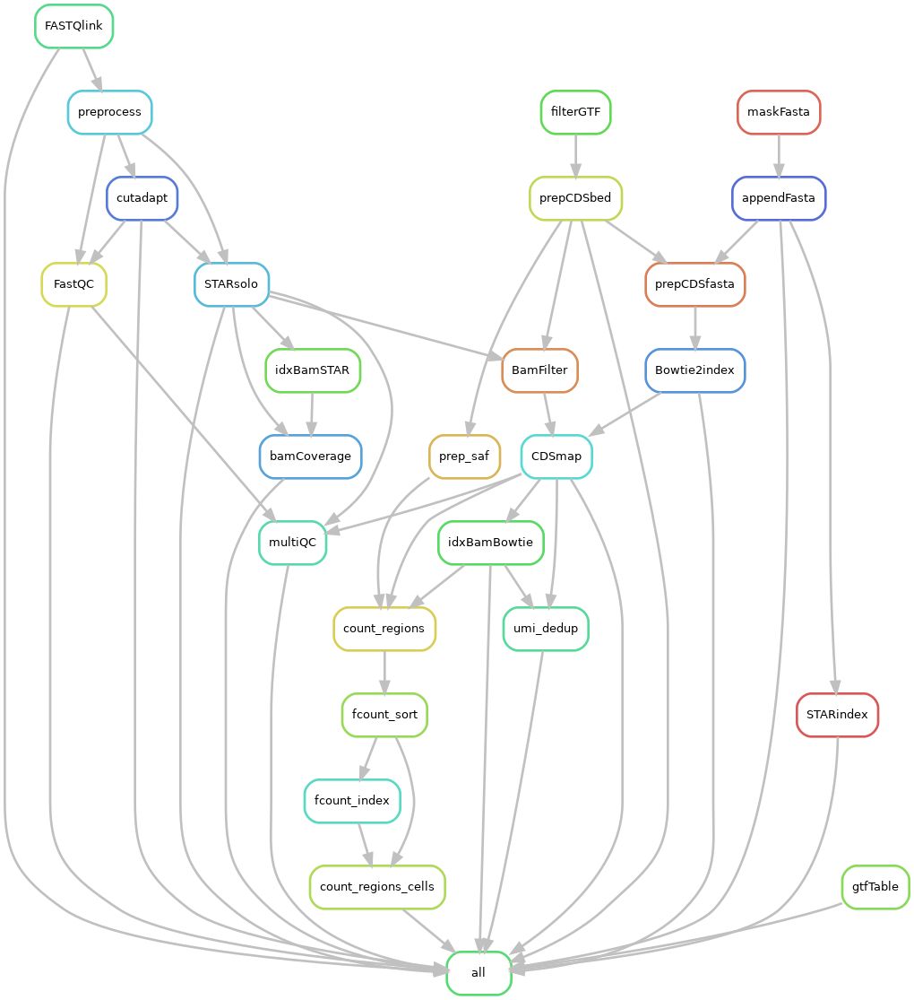

# scRiboQuant
Workflow for single-cell ribo-seq analysis


**Author: @vivekbhr**

## DAG (Directed Acyclic Graph) of the Workflow




## How to run

### 1. Install via conda

Create a new environment and install the workflow in the environment. (recommended)

```
conda create -n riboseq -c bioconda -c vivekbhr scriboquant
```

Alternative: Install the workflow directly in your base environment.

```
conda install -c bioconda -c vivekbhr scriboquant
```

### 1b. (Alternative) Install via pip from github

Create a new environment.

```
conda create -n riboseq python
```
Install the workflow from the master branch

```
conda activate riboseq
pip install git+https://github.com/vivekbhr/scRiboQuant.git
```


### 2. configure the config.yaml

config.yaml file is needed to provide files and arguments on the workflow that you don't want to repeat everytime you run the workflow, such as path to fasta and gtf files. Copy the `config.yaml` file from [here](./scriboquant/config.yaml) and modify as per your own requirements.

Files needed (provide in the config):

1) Path to the (indexed) genome fasta file
2) (optional) Path to bed file to mask certain regions in the genome and fasta files to append certain regions.
3) Cell barcodes (.txt/tsv file, first column must be cell-barcodes, no header)

### 4. Test the workflow with the provided files

This should only take 3-4 minutes. Copy the test fastq files provided with the repo (testdata) folder and run the workflow like this:

(provided all files in `config.yaml` are accessible)

```
conda activate riboseq

scRiboQuant -i <testdata_folder> -o <output_folder> -c <your_config.yaml> -j <jobs> -cl
```

here **j** is the number of parallel jobs you want to run, **-cl** means submit to cluster (default is to run locally)

**dry run** : in order to just test what the workflow would do, use the command `-s ' -np' `

### Technical Notes
  - After running the pipeline, **LOG** file are stored in the **<output>/log/** directory and the workflow top-level log is in openTAPS.log file.
  - Currently the -o option is not very flexible and and pipeline works only when it's executed in the output directory.
  - cluster configuration, such as memory and cluster submission command are placed in [cluster_config.yaml](./scriboquant/cluster_config.yaml), and can be modified to suite the users internal infrastructure.
